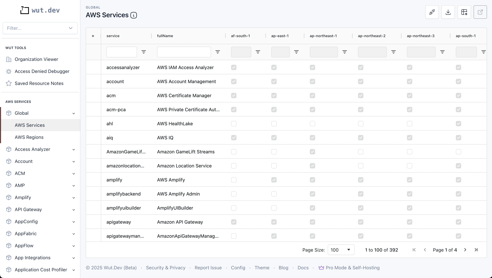

# AWS Region Services Compiler

This script fetches up-to-date AWS region and service metadata from SSM Parameter store and compiles it into a single, consumable JSON object.

The AWS Region metadata includes:
* Region name (e.g., `us-east-1`)
* Domain (`amazonaws.com`, `amazonaws.com.cn`)
* Country geo code (`JP`)
* Geo location region (`DE-HE`)
* Region long name (`Asia Pacific (Thailand)`)
* Partition (`aws`, `aws-us-gov`)

The AWS service metadata includes:
* Service identifier (e.g., `accessanalyzer`)
* Full name (`AWS IAM Access Analyzer`)
* Every region, with a `true` or `false` boolean representing the services's availability in that region

## How It Works

AWS pushes metadata about its regions and services to SSM Parameter Store under the `/aws/service/global-infrastructure` path. You can read more about this on the [AWS Blog](https://aws.amazon.com/blogs/aws/new-query-for-aws-regions-endpoints-and-more-using-aws-systems-manager-parameter-store/).

This script works by recursively loading these parameters to extract the above information about AWS region and service availability.

## Usage
This script is written to be used in a Lambda function (Wut.Dev runs it on a weekly cron job) with the output data written to an S3 bucket.

It can also be run locally using Node.JS. Update the `index.js` file to uncomment the `if (require.main === module) {` section.

You can also edit the `testEvent` array to pass in a smaller number of services while testing (a full execution across all services, with rate limiting, can take ~10 minutes, so it's helpful to specify one or two while testing).

Then run:
```bash
npm install
node index.js
```

## Use Cases
We wrote this script to dynamically generate a matrix of AWS service availability across AWS regions. There are 392 services and 36 regions (as of mid-2025), creating over 14,000 permutations of availability. The resulting JSON file can be used to quickly compare availability across multiple services and regions simultaneously, especially if paired with a table-based UI.

## Hosted AWS Region and Service Availability Matrix
Wut.Dev uses the output of this script to generate a table matrix of AWS regions and service availability:

* [AWS Regions](https://app.wut.dev/?service=global&type=regions)
* [AWS Services](https://app.wut.dev/?service=global&type=services)



On this page, you can filter, sort, search, and export the region availability for any AWS service. We update this source data weekly.

## Alternatives
AWS hosts an official service availability page [here](https://aws.amazon.com/about-aws/global-infrastructure/regional-product-services/), however it does not allow for side-by-side comparison of services across regions.

Another site, [aws-services.info](https://www.aws-services.info/index.html) has similar information, but requires clicking into each service to load its region availability.